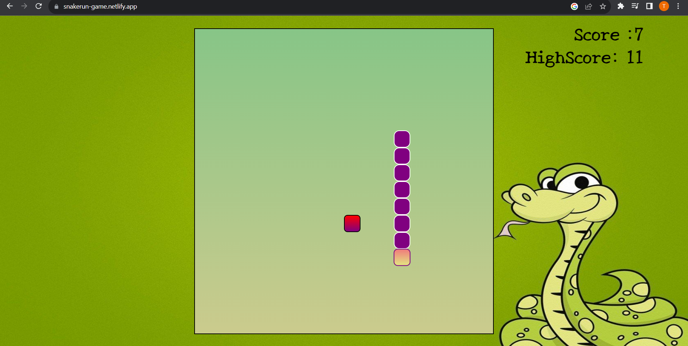

# Snake-Game
# Snake Game with Sound Effects using HTML, CSS, and JavaScript

  

## Introduction

Welcome to my Snake Game project with added sound effects! This classic Snake Game is built using HTML, CSS, and JavaScript to help me improve my coding skills and gain a better understanding of front-end web development. The game features a player-controlled snake that grows longer as it consumes food items, along with immersive sound effects to enhance the gaming experience.

## Features

- Responsive and visually appealing design.
- Smooth and intuitive controls for snake movement.
- Randomly generated food items for the snake to eat.
- Score tracking and display of the player's current score.
- Game over screen with an option to restart the game.
- Engaging sound effects for interactions and game events.

## Technologies Used

- HTML5: Structuring the game layout.
- CSS3: Styling the game elements and making it visually appealing.
- JavaScript: Implementing game mechanics, logic, user interactions, and sound effects.

## Sound Effects

- `chomp.mp3`: Played when the snake eats a food item.
- `gameOver.mp3`: Played when the game ends.
- `backgroundMusic.mp3`: Optional background music that plays during gameplay.

## Acknowledgments

I would like to express my gratitude to the following resources that helped me in creating this project:

- [MDN Web Docs](https://developer.mozilla.org/): A valuable reference for HTML, CSS, and JavaScript concepts.
- [freeCodeCamp](https://www.freecodecamp.org/): An excellent platform for learning web development.

---

Enjoy the immersive gaming experience with sound effects! If you have any suggestions, issues, or ideas for improvement, please don't hesitate to [open an issue](https://github.com/your-username/snake-game/issues) or submit a pull request. Have a blast playing and coding!
## To visit the website,click on the link given below:

## 👉 https://snakerun-game.netlify.app/

